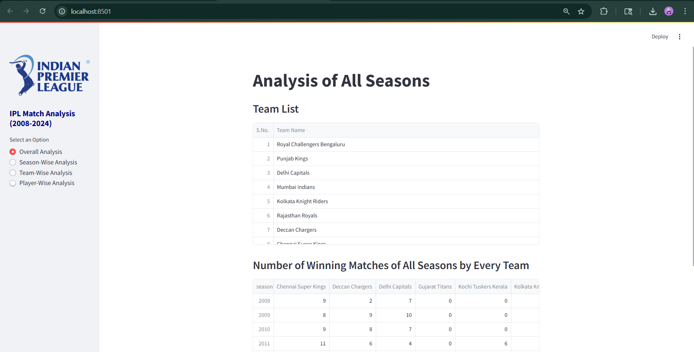
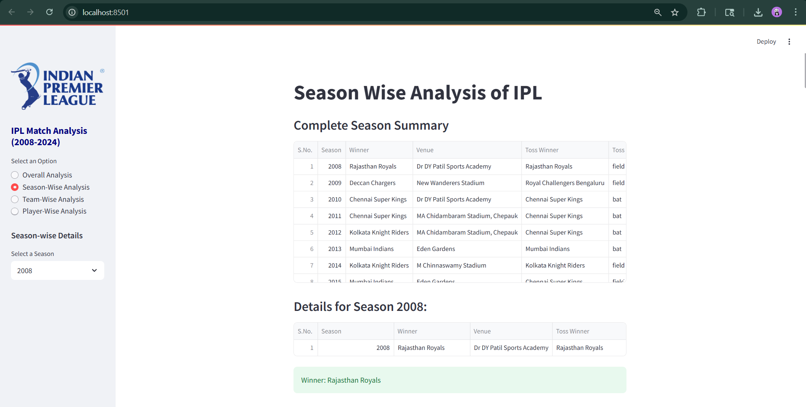
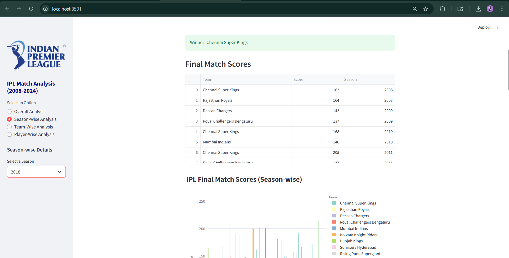
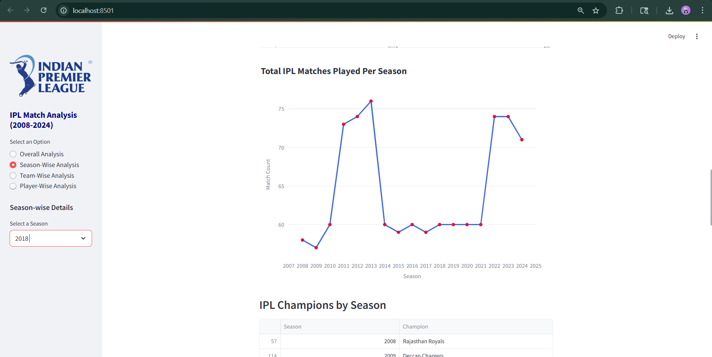
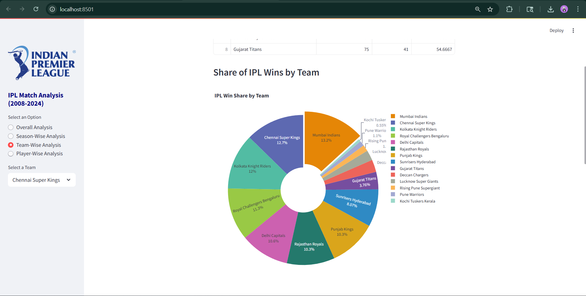
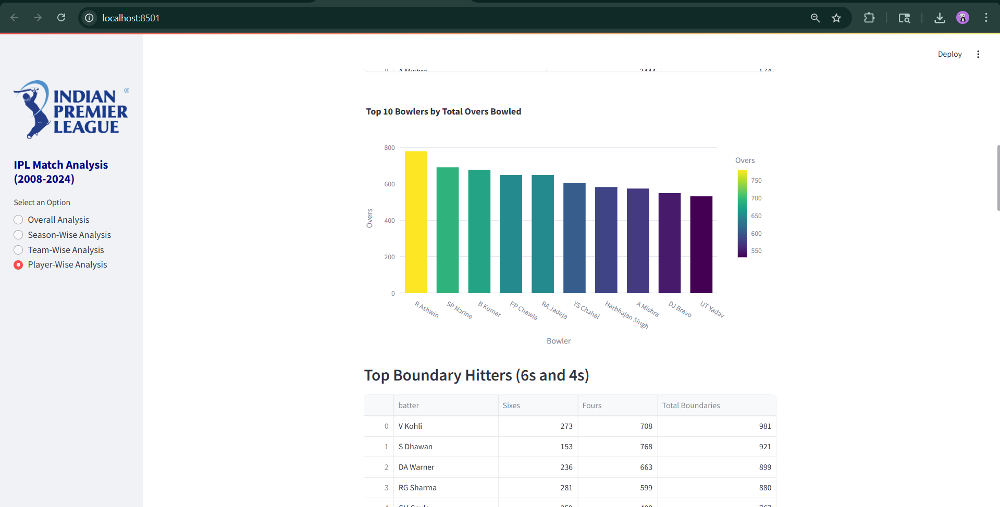
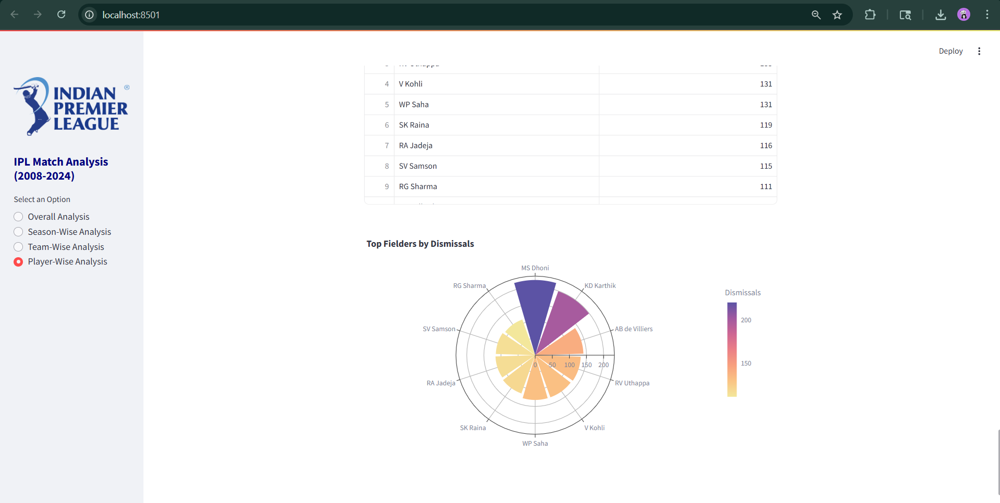

# 🏏 IPL Data Analysis Dashboard

This project provides an end-to-end, interactive dashboard for analyzing the Indian Premier League (IPL) dataset using Python, Streamlit, and modern data visualization tools.

## 🔍 Features

- 🎯 Team-wise & Season-wise Analysis
- 🧠 Player Stats: Runs,Batters, Bowlers, Strike Rate
- 📊 Professional Visualizations (Seaborn, Plotly, Matplotlib)
- 🧭 Sidebar Navigation with Filters & Dropdowns
- 💡 Designed for both performance and readability

## 🛠️ Technologies Used

- Python (Pandas, NumPy)
- Streamlit (for web dashboard)
- Plotly, Matplotlib, Seaborn (for graphs)
- Git & GitHub (for version control)

## 📁 Dataset
- `matches.csv` & `deliveries.csv` (official IPL match-by-match data)

## 📷 Screenshots








## 🚀 Getting Started

```bash
git clone https://github.com/ajeetraghuvanshi786/IPL_Analysis.git
cd IPL-Data-Analysis
pip install -r requirements.txt
streamlit run app.py
